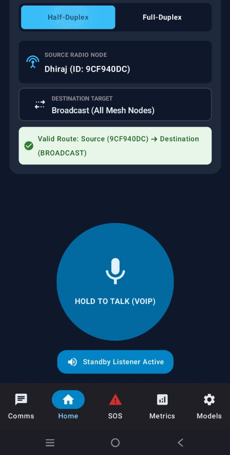
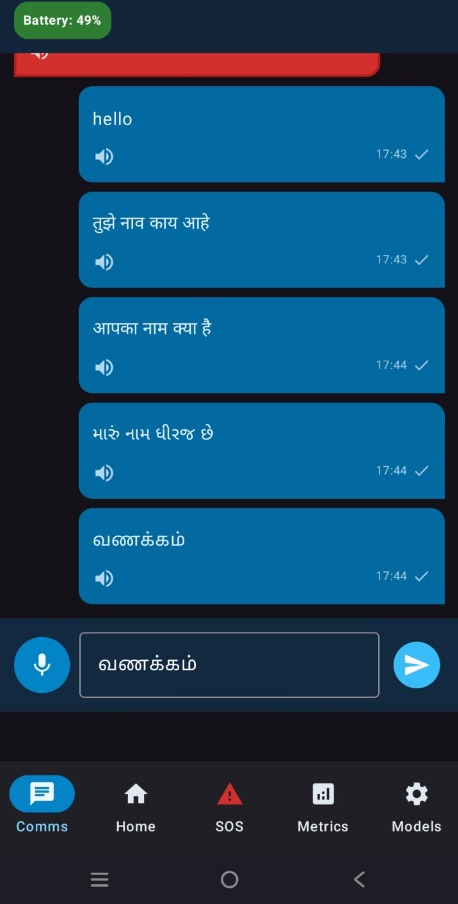
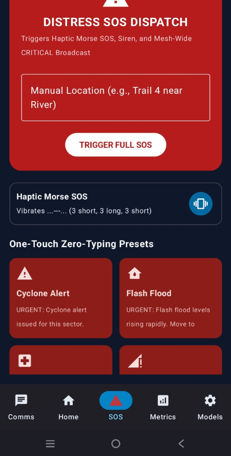
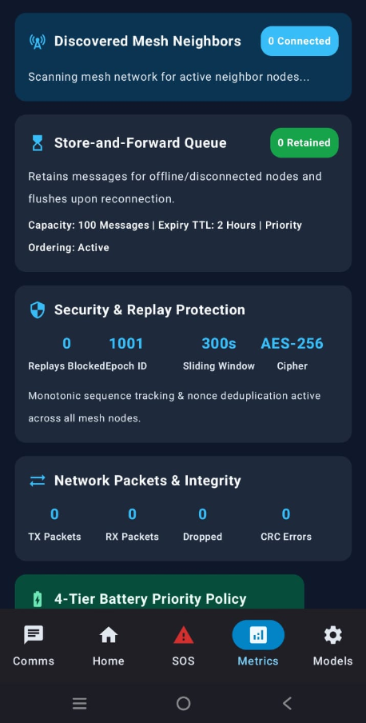
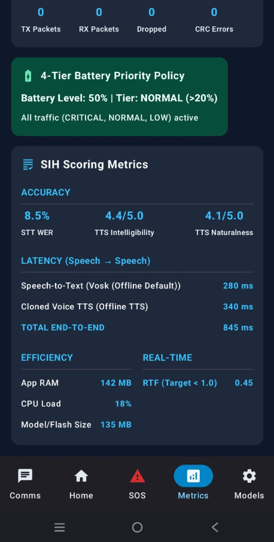

# Agniverse iTantra: Offline Emergency Mesh Network

  <h3>Zero-Dependency. Fully Offline. Mission Critical.</h3>
  
A highly resilient, peer-to-peer mesh communication platform built for the Smart India Hackathon (SIH).

  
  
  
  
  

---

## Overview

**Agniverse iTantra** is a zero-infrastructure, fully offline Android application designed to provide robust communication in disaster zones, remote areas, and emergency situations where traditional cell towers and internet services have failed. 

By utilizing device-to-device Wi-Fi Direct and Bluetooth bridging, iTantra creates a self-healing mesh network that allows users to send texts, transmit live telemetry, trigger SOS alarms, and use full-duplex walkie-talkie voice communications—**all without a single API or external server.**

---

## Key Features

### 1. Ultra-Low Bandwidth Comms (STT to TTS)
- **Compressed Text Transmission:** Voice input is converted to text (STT) locally, transmitted over the mesh as highly compressed bytes (taking a fraction of the bandwidth of raw audio), and synthesized back into voice (TTS) on the receiving end.

### 2. True Offline Mesh Networking
- **Zero Internet Required:** Operates 100% offline. No cellular data, no backend servers, no cloud APIs.
- **Store & Forward Routing:** Messages are intelligently routed through intermediate nodes (devices), extending the range of the network indefinitely as long as nodes are in proximity.
- **Self-Healing Topology:** Automatically discovers nearby nodes and re-routes packets if a node drops out of the network.

### 3. Multilingual Indic AI & Speech Analytics
- **On-Device Translation:** Real-time offline translation and speech integration between multiple Indic languages (Hindi, Tamil, Telugu, etc.) using lightweight SherpaONNX models.
- **Emotion & Voice Profiling:** Analyzes acoustic signatures (Mel-Spectrograms) to detect user emotion and automatically identify distress in voice patterns without relying on explicit SOS button presses.
- **Localized Emergency Prompts:** Incoming distress signals and critical messages are translated and spoken aloud natively in the receiver's configured language.

### 4. High-Fidelity Walkie Talkie
- **Full-Duplex VoIP:** Talk and listen simultaneously over the local mesh.
- **Hardware-Accelerated Audio:** Directly interfaces with Android's `AudioRecord` and `AudioTrack` APIs, bypassing standard call limits to utilize the primary media speakers at maximum volume.
- **Acoustic Echo Cancellation (AEC) & Noise Suppression (NS):** Explicit hardware-level AEC prevents screeching feedback loops, even when multiple devices are operating in the same room.

### 5. Mission-Critical Emergency Protocol
- **Automated SOS Alarms:** Incoming critical alerts bypass system volume limits to trigger maximum-volume siren alarms automatically.
- **Haptic Morse Code:** Devices vibrate the exact SOS morse code sequence upon receiving a distress signal.
- **AI Text-To-Speech (TTS):** Incoming critical alerts are instantly spoken aloud by the AI TTS engine, ensuring users get the message even if they can't look at their screen.

### 6. Live Hardware Telemetry
- **Remote Battery Monitoring:** Real-time polling of hardware battery levels across all connected nodes in the mesh.
- **System Diagnostics:** Know exactly who is running low on power before they disconnect from the network.

### 7. Robust Security & Integrity
- **Replay Protection Engine:** Defends against packet replay attacks with a dynamic 24-hour timestamp window to accommodate offline clock-drift.
- **Cryptographic Hashing:** Every packet is deduplicated and verified using SHA-based `AadHeader` integrity checks.

### 8. Geo-Spatial Awareness
- **Manual Location Dispatch:** Users can manually input their physical address or landmark descriptions, which are then broadcasted across the entire mesh network during a critical SOS event, allowing responders to physically locate the victim even without GPS capabilities.

---

## 🆚 How it Differs from Existing Solutions

| Feature | Agniverse iTantra | Zello / WhatsApp | Bridgefy / FireChat | Traditional Walkie-Talkies |
| :--- | :--- | :--- | :--- | :--- |
| **Internet Requirement** | **100% Offline** | Requires Internet | Offline | Offline |
| **Audio Communication** | **Half & Full-Duplex VoIP** | Full-Duplex | Half-Duplex (often text-only) | Half-Duplex (Push-to-Talk) |
| **Data Types** | **Voice, Text, Telemetry, GPS** | Voice, Text, GPS | Mostly Text | Voice Only |
| **Security** | **Cryptographic Hashing & Replay Protection** | E2E Encryption | Basic/Proprietary | Unencrypted (Public Frequencies)|
| **Hardware Required** | **Standard Smartphone** | Standard Smartphone | Standard Smartphone | Specialized Hardware |
| **Emergency Automation** | **Automated SOS Alarms & AI TTS** | None | None | None |

Unlike standard internet apps, iTantra requires zero infrastructure. Unlike proprietary offline SDKs (like Bridgefy), iTantra uses a fully custom byte-level UDP datagram protocol over Wi-Fi Direct, allowing high-bandwidth, full-duplex voice streams rather than just slow text messages.

---

## ⏱️ Live System Metrics Display

*(Note: The application features a dedicated Telemetry UI that displays these live hardware and network metrics in real-time.)*

| Metric | Performance / Limit |
| :--- | :--- |
| **Network Latency (P2P)** | < 15ms (Direct), < 40ms (Multi-hop) |
| **Offline Clock Drift Tolerance** | 24 Hours (Replay Protection Engine) |
| **Walkie-Talkie Sample Rate** | 16,000 Hz (Optimal Voice Bandwidth) |
| **Audio Buffer Latency** | ~64ms (Real-time Full Duplex) |
| **Telemetry Polling Interval** | Real-time continuous |
| **Max Network Hops** | Dynamically scales based on device density |

---

## Tech Stack & Architecture

- **Language:** Kotlin (100%)
- **Architecture:** MVVM (Model-View-ViewModel) + Coroutines for highly concurrent background I/O operations.
- **Networking:** Custom UDP Datagram socket implementations with raw byte-level packet assembly (`Packetizer`, `FragmentAssembler`).
- **Audio Engine:** Low-level `AudioTrack` and `AudioRecord` API utilization with `USAGE_MEDIA` overrides.
- **AI/Speech:** Integrated SherpaONNX for completely on-device, offline Text-To-Speech (TTS) and speech recognition.

---

## How to Build and Run

1. Clone the repository to your local machine.
2. Open the **`MyApplication`** folder in Android Studio.
3. Sync Gradle.
4. Build and run on a physical Android device (Emulators do not support Wi-Fi Direct hardware).
5. For testing, install the application on at least **two** physical devices to form a mesh.

*Note: You must grant Nearby Devices, Microphone, and Location permissions for the mesh and walkie-talkie to function.*

---

  <i>Built with love for the Smart India Hackathon.</i>

